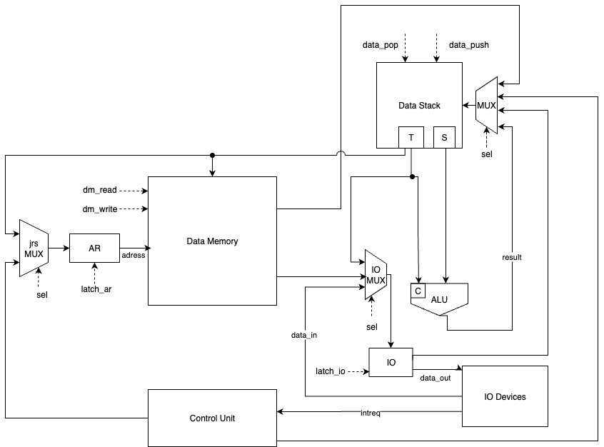
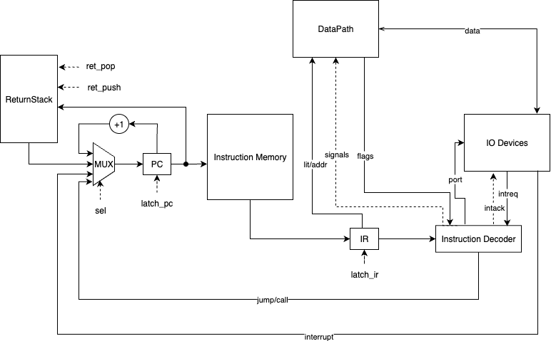

# Лабораторная работа 4

- Студент: Яснов Михаил, Р3217.
- `alg | stack | harv | hw | tick | binary | trap | port | cstr | prob2`

## Язык программирования

```ebnf
<program> ::= <function>*

<function> ::= 'func' <identifier> '(' ')' <block>

<block> ::= '{' <statement>* '}'

<statement> ::= <variable-declaration> ';'
              | <assignment> ';'
              | <function-call> ';'
              | <while-statement>
              | <if-statement>
              | 'break' ';'
              | <print-statement> ';'
              | <print-int-statement> ';'

<variable-declaration> ::= <type> <identifier>
<type> ::= 'int' | 'long' | 'string' | 'char'
<assignment> ::= <identifier> '=' <expression>

<while-statement> ::= 'while' '(' <expression> ')' <block>
<if-statement> ::= 'if' '(' <expression> ')' <block> ['else' <block>]

<print-statement> ::= 'print' '(' (<string-literal> | <expression>) ')'
<print-int-statement> ::= 'printInt' '(' <expression> ')'

<function-call> ::= <identifier> '(' [<expression> {',' <expression>}] ')'

<expression> ::= <comparison-expr>
<comparison-expr> ::= <additive-expr> [('<=' | '==') <additive-expr>]
<additive-expr> ::= <multiplicative-expr> {('+' | '-') <multiplicative-expr>}
<multiplicative-expr> ::= <primary-expr> {'*' <primary-expr>}

<primary-expr> ::= <integer-literal>
                 | 'true'
                 | <identifier> ['(' [<expression> {',' <expression>}] ')']

<identifier> ::= [a-zA-Z_][a-zA-Z0-9_]*
<integer-literal> ::= [0-9]+
<string-literal> ::= '"' [^"]* '"'
```

- Аппликативный порядок вычислений. Аргументы вычисляются до передачи в функцию.
- По умолчанию вычисление аргументов идёт слева направо. Это естественный порядок для императивного языка с побочными эффектами.
- Область видимости данных полностью глобальная: все переменные видны во всех функциях, нет вообще никаких ограничений видимости.
- Типизация статическая, с явным указанием типов при объявлении переменных.
- Есть поддержка целочисленных (`int`, `long`) и строковых литералов.
- `readInt()`, `readChar()`, `readString()`, `readLong()` позволяют читать данные из портов ввода-вывода.
- `print()` и `printInt()` выводят строки и числа соответственно.
- `printChar()` и `printLong()` для вывода символов и 64-битных чисел.
- `set(arr, idx, val)` и `get(arr, idx)` для работы с массивами в памяти данных.
- `ei()` и `di()` позволяют разрешать/запрещать прерывания.

Семантика:

- Стратегия вычислений — строгая, порядок слева направо.
- Ассоциативность/приоритет: `*` выше `+ -`, затем сравнения `<=`, `==`. Скобок для группировки выражений нет — полагайтесь на приоритет.
- Область видимости — глобальная: все переменные видны во всех функциях; функции `main` и `irqN` (N∈[1..]) — точки входа/обработчики.
- Типизация — статическая. Булевы значения представлены целыми `0/1`. `char` хранится как число (8-бит) в 32-битном слове; `long` — в двух соседних словах (lo/hi).
- Литералы: целые десятичные (`INT`) и строковые (`"..."`). Строковый литерал допустим в `print("...")` и помещается как C-строка (NUL-терминатор).
- Встроенные функции: `readInt()/readChar()/readString()/readLong()` — чтение из портов; `printInt()/print()/printChar()/printLong()` — вывод; `ei()/di()` — управление прерываниями; `set/get` — работа с массивами (переменная хранит указатель на буфер).
- Условие в `if/while`: ноль — ложь, любое ненулевое — истина.

Отображение на стековую ISA:

- выражения генерируют стековые операции (`PUSHI`, `ADD`, `SUB`, `MUL`, `LE`, т.п.);
- переменные — ячейки в памяти данных; `LOAD`/`STORE` по адресам;
- массивы — через вспомогательные вызовы `set(arr, idx, val)` и `get(arr, idx)`; переменная хранит указатель на буфер (выделяется при первом использовании);
- строки — литералы размещаются в данных, печать — процедурой итерации до `\0`.

## Организация памяти

Модель памяти процессора:

1. Память данных. Машинное слово — 32 бита. Адреса по 32 бита. Линейное адресное пространство. Реализуется списком знаковых чисел. Только абсолютная адресация.
2. Память команд. Машинное слово — 32 бита. Адреса по 32 бита. Линейное адресное пространство. Только абсолютная адресация. Гарвардская архитектура — отдельная память для инструкций:
   - Инструкции с аргументами занимают машинное слово целиком (32 бита): старший байт — опкод, младшие 24 бита — аргумент.
   - Все инструкции имеют единый формат, что упрощает декодирование.
3. Стек данных. Неограниченный стек для вычислений. Видимые регистры: `T` (вершина) и `Z` (второй элемент).
4. Стек возвратов. Отдельный стек для адресов возврата из подпрограмм и прерываний.

Напрямую влиять программист может только на память данных, стек данных и регистр T (вершину стека). Также возможно неявное влияние на стек возврата вызовом процедур и возвратом из них.

Статические и динамические данные вместе хранятся в памяти данных без разделения на секции статических и динамических данных.

Память под статические и динамические данные выделяется во время трансляции. Транслятором предоставляется бинарный файл с аллоцированными буферами, литералами и местом под переменные.

Динамического выделения памяти нет, сборки мусора нет. Вследствие этого списки динамического размера не реализованы.

В начале памяти команд расположена таблица векторов прерываний (первые `DEFAULT_NUM_VECTORS=8` слов). Вектор 0 содержит переход на `main`, векторы 1-7 — на обработчики `irq1`-`irq7` соответственно.

```text
       Registers
+------------------------------+
| T                            |
| Z                            |
| AR (Address Register)        |
| IO (I/O Register)            |
| IR (Instruction Register)    |
| PC (Program Counter)         |
+------------------------------+

       Instruction memory
+------------------------------+
| 00  : jmp main               |
| 01  : jmp irq1               |
| 02  : jmp irq2               |
|    ...                       |
| 07  : jmp irq7               |
| 08  : main start             |
|    ...                       |
|     : halt                   |
| f   : function 1 body        |
|    ...                       |
| g   : irq1 handler body      |
|    ...                       |
+------------------------------+

          Data memory
+------------------------------+
| s   : string literal 1 start |
| s+1 : string literal 1       |
|    ...                       |
| s+n : \0                     |
|    ...                       |
| b   : buffer1[0]             |
| b+1 : buffer1[1]             |
|    ...                       |
| v   : variable 1             |
| v+1 : variable 2 (lo)        |
| v+2 : variable 2 (hi)        |
|    ...                       |
+------------------------------+
```

- Целочисленные литералы преобразуются в `PUSHI` значения на стек данных.
- Строковые литералы располагаются в памяти данных с добавлением нуль-терминатора, а в коде преобразуются в `PUSHI` адреса начала строки в памяти данных.
- Переменные отображаются в загрузку значения переменной из памяти данных на стек данных.
- Есть возможность аллоцировать статический буфер для массивов. Переменная-массив хранит указатель на начало буфера.
- В начале все процедуры сохраняют переданные им параметры в память данных, чтобы дальше по ходу выполнения обращаться с ними как с обычными переменными. Это сделано, чтобы не реализовывать сложные алгоритмы размещения аргументов на стеке перед вызовом функции и чтобы не реализовывать доступ к случайному элементу стека.
- Функции с названиями `irqN` считаются обработчиками прерываний соответствующего (N-ого) порта.

## Система команд

Особенности процессора:

- Доступ к памяти данных осуществляется по адресу, хранящемуся в регистре `AR`. Установка адреса производится из вершины стека при `LOAD` или явным значением при `STORE`.
- Есть возможность запрещать и разрешать прерывания командами `EI`/`DI`.
- Все инструкции имеют единый формат 32 бита (8 бит опкод + 24 бита аргумент).
- Реализована поддержка портового ввода-вывода с прерываниями.
- Когда на порту появляются данные, генерируется прерывание для соответствующего обработчика `irqN`.

### Набор инструкций

Формат инструкции:

```text
┌────────────┬─────────────────────────────────────┐
│ 31 ... 24  │ 23 ... 0                            │
├────────────┼─────────────────────────────────────┤
│  opcode    │ arg (адрес/непосредственное/порт)   │
└────────────┴─────────────────────────────────────┘
```

#### Работа со стеком и памятью

- `0x00` — `NOP` — Ничего не делать (3 такта)
- `0x01` — `PUSHI <value>` — Загрузить 24-битное знаковое значение на стек (3 такта)
- `0x02` — `LOAD` — Загрузить значение из памяти по адресу с вершины стека (5 тактов)
- `0x03` — `STORE` — Сохранить второе значение стека по адресу с вершины стека (5 тактов)
- `0x04` — `DUP` — Дублировать вершину стека (3 такта)
- `0x05` — `DROP` — Удалить вершину стека (3 такта)
- `0x06` — `SWAP` — Поменять местами два верхних элемента стека (3 такта)

#### Арифметические операции

- `0x10` — `ADD` — Сложение двух чисел с вершины стека (5 тактов)
- `0x11` — `SUB` — Вычитание (T = Z - T) (5 тактов)
- `0x12` — `MUL` — Умножение (5 тактов)
- `0x13` — `DIV` — Целочисленное деление (T = Z / T) (5 тактов)

#### Операции сравнения

- `0x41` — `LE` — Меньше или равно (Z <= T), результат 0 или 1 (5 тактов)

#### Управление потоком

- `0x20` — `JMP <addr>` — Безусловный переход (3 такта)
- `0x21` — `JZ <addr>` — Переход если вершина стека равна 0 (3 такта)
- `0x22` — `CALL <addr>` — Вызов подпрограммы (3 такта)
- `0x23` — `RET` — Возврат из подпрограммы (3 такта)
- `0x24` — `IRET` — Возврат из прерывания (3 такта)
- `0x25` — `EI` — Разрешить прерывания (3 такта)
- `0x26` — `DI` — Запретить прерывания (3 такта)

#### Ввод-вывод

- `0x30` — `IN <port>` — Прочитать значение из порта (4 такта)
- `0x31` — `OUT <port>` — Вывести значение в порт (4 такта)

#### Управление

- `0xFF` — `HALT` — Остановить выполнение (3 такта)

### Кодирование и выполнение

Машинный цикл состоит из трёх фаз:

1. `FETCH_IR` — загрузка инструкции из памяти команд в IR (1 такт)
2. `LATCH_PC` — инкремент счётчика команд (1 такт)
3. `EXEC` — выполнение инструкции (1-3 такта в зависимости от операции)

Прерывания проверяются в начале фазы `FETCH_IR`. При наличии прерывания:

- Текущий PC сохраняется в стек возвратов
- PC загружается из соответствующего вектора прерываний
- Устанавливается флаг обработки прерывания (сбрасывается по `IRET`)

Примеры машинного кода:

```text
0 - 0100002A - pushi 42    # загрузить 42 на стек
1 - 01000064 - pushi 100   # загрузить 100 на стек
2 - 10000000 - add         # сложить два числа
3 - 31000002 - out 2       # вывести результат в порт 2
```

## Транслятор

Интерфейс командной строки: `python -m translator <input_file> <target_file> [--hex <hex_file>]`

Реализовано в модулях: [translator/](./translator/)

Этапы трансляции (функция `compile`):

1. **Лексический анализ** ([lexer.py](./translator/lexer.py)) — преобразование текста в последовательность токенов:
   - Распознавание ключевых слов: `func`, `int`, `long`, `string`, `char`, `while`, `if`, `else`, `break`, `print`, `printInt`
   - Выделение идентификаторов, чисел, строковых литералов
   - Обработка комментариев (`//`)
   - Проверка парности скобок и операторных символов

2. **Синтаксический анализ** ([parser.py](./translator/parser.py)) — построение AST из токенов:
   - Парсинг объявлений функций
   - Разбор операторов: присваивание, циклы, условия, вызовы
   - Построение дерева выражений с учётом приоритетов операций

3. **Генерация кода** ([codegen.py](./translator/codegen.py)):
   - Формирование таблицы векторов прерываний (8 слов в начале)
   - Размещение переходов на `main` и обработчики `irqN`
   - Компиляция тела программы и функций
   - Выделение памяти под переменные и строковые литералы
   - Генерация инструкции `HALT` после основного кода

4. **Кодирование** ([isa.py](./isa.py)):
   - Преобразование инструкций в 32-битные слова (little-endian)
   - Создание бинарного файла и опционального hex-листинга

Правила генерации машинного кода:

- Вложенные выражения вычисляются рекурсивно, результаты помещаются на стек
- Переменные отображаются на адреса в памяти данных
- Строковые литералы инициализируются в памяти данных при старте программы
- Массивы реализуются через указатели с функциями `get`/`set`
- Функции `long` типа обрабатываются специально (два слова lo/hi)
- Поддержка прерываний через именование функций `irqN`

## Модель процессора

Интерфейс командной строки: `python machine_cli.py <program.bin> [--schedule <schedule.txt>] [--data-words N] [--ticks N] [--trace]`

Реализовано в модулях: [core/](./core/)

### DataPath



`data_memory` — однопортовая память, поэтому либо читаем, либо пишем.

Сигналы (обрабатываются за один такт, реализованы в виде методов класса):

- `latch_ar` — защёлкнуть выбранное значение в `AR`:
    - Из регистра T (вершина стека) через MUX
    - Литерал от ControlUnit через MUX
- `dm_read` / `dm_write` — чтение/запись памяти данных по адресу из AR
- `data_push` / `data_pop` — операции со стеком данных
- `latch_io` — защёлкивание в регистр IO через IO MUX:
    - Из регистра T
    - Из устройства ввода-вывода
- Сигналы выбора для мультиплексоров (sel)

Флаги:

- `zero` — отражает нулевое значение в регистре T
- `sign` — отражает знак значения в регистре T (бит 31)
- `carry` — флаг переноса, устанавливается при переполнении в арифметических операциях

Регистры:

- `T` — вершина стека данных (32 бита)
- `Z` — второй элемент стека (32 бита)  
- `AR` — регистр адреса для обращения к памяти (32 бита)
- `IO` — регистр ввода-вывода (32 бита)

Мультиплексоры (согласно схеме):

- MUX перед AR — выбор между T и литералом от CU
- MUX в стек — выбор между: литералом, памятью, ALU, IO
- IO MUX — выбор между T и данными от устройств

### ControlUnit



- Hardwired (жёсткая логика)
- Метод `step_tick` моделирует выполнение одного такта процессора
- Фазовая машина состояний: `FETCH_IR` → `LATCH_PC` → `EXEC`
- Многотактовые инструкции используют внутренний счётчик шагов `_step`

Сигналы (согласно схеме):

- `latch_pc` — защёлкивание значения в PC через MUX:
    - PC+1 (инкремент)
    - Из стека возвратов (RET/IRET)
    - Адрес из IR (JMP/CALL)
    - От устройства прерываний
- `latch_ir` — загрузка инструкции из памяти команд в IR
- `ret_push` / `ret_pop` — управление стеком возвратов
- `intreq` — запрос прерывания от IO устройств
- `intack` — подтверждение прерывания
- Сигналы к DataPath для выполнения инструкций
- Анализ флагов от DataPath для условных переходов

Особенности работы модели:

- Цикл симуляции осуществляется в функции `run_machine` ([core/runner.py](./core/runner.py))
- Шаг моделирования соответствует одному такту с выводом состояния в трассу
- Трассировка включает: tick, phase, PC, T, Z, AR, flags, in_isr
- Количество тактов для моделирования ограничено (по умолчанию 100000)
- Остановка моделирования при:
    - Превышении лимита тактов
    - Выполнении инструкции `HALT`
    - Критической ошибке

### Взаимодействие с IO

- Класс `IOController` управляет портами и прерываниями
- События ввода подаются по расписанию (tick, port, value)
- При поступлении данных на порт генерируется запрос прерывания
- CPU проверяет прерывания в начале каждого цикла выборки инструкции
- Обработчик прерывания `irqN` вызывается для порта N

## Тестирование

Тестирование выполняется при помощи golden test-ов. Реализовано в [golden_tests.py](./golden_tests.py)

Golden тесты находятся в директории `golden/`:

- [hello_world](./golden/hello_world/) — вывод строки
- [cat](./golden/cat/) — эхо ввода
- [hello_user_name](./golden/hello_user_name/) — приветствие пользователя
- [prob2](./golden/prob2/) — решение задачи Project Euler #2
- [double_precision](./golden/double_precision/) — 64-битная арифметика
- [sort](./golden/sort/) — сортировка массива
- [cat_trap](./golden/cat_trap/) — работа с прерываниями

Запустить тесты: `python golden_tests.py --verify`

Обновить golden тесты: `python golden_tests.py --out-dir golden`

Пример использования транслятора:

```shell
$ cat examples/hello_world.alg
// hello.alg – prints a greeting to the console

func main() {
    // Output a greeting message
    print("Hello, world!");
}

$ python -m translator examples/hello_world.alg out.bin --hex out.hex
$ xxd -g 1 out.bin | head -10
00000000: 08 00 00 20 00 00 00 20 00 00 00 20 00 00 00 20  ... ... ... ... 
00000010: 00 00 00 20 00 00 00 20 00 00 00 20 00 00 00 20  ... ... ... ... 
00000020: 48 00 00 01 00 00 00 01 00 00 00 03 65 00 00 01  H...........e...
00000030: 01 00 00 01 00 00 00 03 6c 00 00 01 02 00 00 01  ........l.......
00000040: 00 00 00 03 6c 00 00 01 03 00 00 01 00 00 00 03  ....l...........
00000050: 6f 00 00 01 04 00 00 01 00 00 00 03 2c 00 00 01  o...........,...
00000060: 05 00 00 01 00 00 00 03 20 00 00 01 06 00 00 01  ........ .......
00000070: 00 00 00 03 77 00 00 01 07 00 00 01 00 00 00 03  ....w...........
00000080: 6f 00 00 01 08 00 00 01 00 00 00 03 72 00 00 01  o...........r...
00000090: 09 00 00 01 00 00 00 03 6c 00 00 01 0a 00 00 01  ........l.......

$ cat out.hex | head -20
0 - 20000008 - jmp 8
1 - 20000000 - jmp 0
2 - 20000000 - jmp 0
3 - 20000000 - jmp 0
4 - 20000000 - jmp 0
5 - 20000000 - jmp 0
6 - 20000000 - jmp 0
7 - 20000000 - jmp 0
8 - 01000048 - pushi 72
9 - 01000000 - pushi 0
10 - 03000000 - store
11 - 01000065 - pushi 101
12 - 01000001 - pushi 1
13 - 03000000 - store
14 - 0100006C - pushi 108
15 - 01000002 - pushi 2
16 - 03000000 - store
17 - 0100006C - pushi 108
18 - 01000003 - pushi 3
19 - 03000000 - store
```

Пример использования модели процессора:

```shell
$ python machine_cli.py out.bin --trace | head -30
t=0 pc=0 phase=FETCH_IR T=0 Z=0 AR=0 zero=1 sign=0 in_isr=0
t=1 pc=0 phase=LATCH_PC T=0 Z=0 AR=0 zero=1 sign=0 in_isr=0
t=2 pc=1 phase=EXEC T=0 Z=0 AR=0 zero=1 sign=0 in_isr=0
t=3 pc=8 phase=FETCH_IR T=0 Z=0 AR=0 zero=1 sign=0 in_isr=0
t=4 pc=8 phase=LATCH_PC T=0 Z=0 AR=0 zero=1 sign=0 in_isr=0
t=5 pc=9 phase=EXEC T=0 Z=0 AR=0 zero=1 sign=0 in_isr=0
t=6 pc=9 phase=FETCH_IR T=72 Z=0 AR=0 zero=0 sign=0 in_isr=0
t=7 pc=9 phase=LATCH_PC T=72 Z=0 AR=0 zero=0 sign=0 in_isr=0
t=8 pc=10 phase=EXEC T=72 Z=0 AR=0 zero=0 sign=0 in_isr=0
t=9 pc=10 phase=FETCH_IR T=0 Z=72 AR=0 zero=1 sign=0 in_isr=0
t=10 pc=10 phase=LATCH_PC T=0 Z=72 AR=0 zero=1 sign=0 in_isr=0
t=11 pc=11 phase=EXEC T=0 Z=72 AR=0 zero=1 sign=0 in_isr=0
t=12 pc=11 phase=EXEC T=72 Z=0 AR=0 zero=0 sign=0 in_isr=0
t=13 pc=11 phase=EXEC T=0 Z=0 AR=0 zero=1 sign=0 in_isr=0
t=14 pc=11 phase=FETCH_IR T=0 Z=0 AR=0 zero=1 sign=0 in_isr=0
...
CH| Hello, world!
```